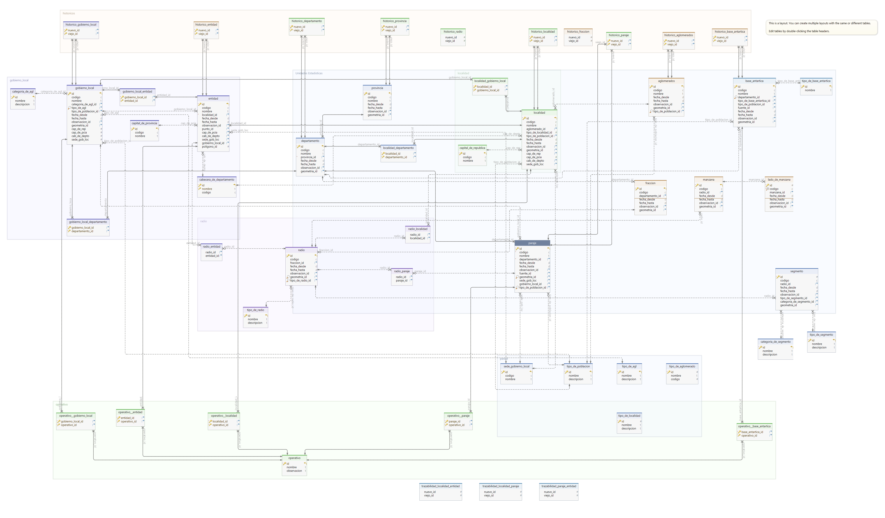

```{r setup, include=FALSE}
knitr::opts_chunk$set(echo = TRUE)

library(dotenv)
library(DBI)
library(RPostgreSQL)
library(knitr)
library(kableExtra)
options(knitr.table.format = "latex")

dotenv::load_dot_env()

dsn_database <- Sys.getenv("DATABASE_DB") # Specify the name of your Database
# Specify host name e.g.:"aws-us-east-1-portal.4.dblayer.com"
dsn_hostname <- Sys.getenv("DATABASE_HOST") #
dsn_port <- Sys.getenv("DATABASE_PORT") # Specify your port number. e.g. 98939
dsn_uid <- Sys.getenv("DATABASE_USER") # Specify your username. e.g. "admin"
dsn_pwd <- Sys.getenv("DATABASE_PASSWORD") # Specify your password. e.g. "xxx"

tryCatch({
    drv <- dbDriver("PostgreSQL")
    print("Conectando a la Base de Datos…")
    con <- dbConnect(drv,
                 dbname = dsn_database,
                 host = dsn_hostname,
                 port = dsn_port,
                 user = dsn_uid,
                 password = dsn_pwd)
    },
    error=function(cond) {
            print("Esh imposhible!")
    })
```

# Sistema de Integración Geográfica y Estadística (INDEC) {-}

Un proyecto de la Coordinación del Sistema [Geoestadístico](geoestadistica) (CSG) de la Dirección Nacional de Metodología e Infraestructura 
Estadística (DNMIE) del Instituto Nacional de Estadística y Censos (INDEC Argentina) para la CSG y las Direcciones Provinciales 
de Estadísticas (DPE).

# Introducción

El presente documento es una 
propuesta estratégica de la Coordinación del Sistema Geoestadístico (CSG). 
El objetivo es establecer la metodología de trabajo para 
la gestión de la base geográfica del INDEC en la CSG 
y en las áreas geoestadísticas de las Direcciones Provinciales de Estadística 
durante el decenio 2020-2030.


Dentro del plan estructurado en varios ejes, aquí abordamos el punto 2:
**Implementación de la Base de Datos Relacional y Topológica en la CSG y las DPE.**

(* Extraído del "MasterPlan")

## Objetivos

1.  Administración de la unidades geoestadísticas básicas y 
sus relaciones con el modelo geográfico social/legal 
para el manejo de la información estadística.

2.  Control intrínseco de la 
la consistencia de las unidades geoestadísticas. 
Esto sería el control topologico a distintos niveles.

3.  Mantenimiento de la trazabilidad 
de las unidades geoestadísticas 
a lo largo del tiempo.
A nivel de codificación y geografía.

4.  Administración de las relaciones del modelo geográfico,
sus modificaciones a lo largo del tiempo y 
su participación en los distintos operativos.

5.  Preparación de los datos 
para diferentes publicaciones y aplicativos.

6.  Generación y mantenimiento de la base de datos 
"multifinalitaria" 
(se usa como adjetivo sólo para Catastro, ver https://es.wikipedia.org/wiki/Catastro_multifinalitario
donde también se usa multiprósito como sinónimo)
para el cruce de datos estadísticos 
provenientes de diferentes fuentes 
adecuándose a los distintos ámbitos y 
los diferentes grados de cobertura.

7.  Carga de archivos Shape (.shp, .shx, .dbf, .prj) 
con datos de cartografía urbana.

8.  Carga de archivos E00 (.e00) 
con datos de cartografía urbana.

9.  Carga de archivos DBF 
de listado de viviendas ADRA.

10. Carga de archivos PxxRad en formato DBF. 
Datos de Radios, tipo de radio y su relación con localidad/entidad

## Metas

1.  Construir un Catálogo de imágenes versionado, 
censo2020, censo 2018 (Anabella)

2.  Completar la carga de otras unidades geográficas: . Entidades . Gobiernos Locales . Radios Rurales .

3.  Lograr la integración de datos básicos censo 2022

4.  Lograr la integración de datos de otros registros administrativos.

5.  Consumir geoservicio de geolocalización de INDEC (JC - ArcGis) o evaluar alternativas API GeoRef / Nominatim

6.  Realizar un relevamiento de visores a fin de incorporar/sincronizar intercambio de datos con el sistema.

7.  Desarrollar un módulo para poder dar de baja de Elementos (\*)

8.  Capacitar recursos humanos para... desgloce de capacitaciones..

9.  Incorporar las normativas vigentes en cuanto a nombre de calles y numeración.

10. Generar Reportes de vías de circulación (ver: <http://172.22.26.215/reportes>, <http://172.22.26.215/reportes_2022>)

11. Desarrollar un Sistema de gestión de informes (informes generados por operario)

12. Desarrollar un Sistema para la generación de layers en topología y edición.

13. Generar un "mapa base INDEC" asociado según operativo/tag. (estilos)

14. Incorporar reportes de areas conflictivas: por limites, doble asignación, imputación, etc.

15. Incorporar procedimientos para la validación y/o generación de códigos para los distintos objetos geográficos. (CODIFICACIÓN)

16. Generar módulo de Verificación (tag: verificado?) (verificador x OG?)

17. Actualizar la carga de Archivo de Domicilios de la República Argentina (ADRA) / Actualización de Domicilios

18. Modulo para Integración de alturas de ADRA a la base geográfica. (pensando en otras fuentes)

19. Generar Manual de estilos y estilos para capa base INDEC.

20. Desarrollar Módulo para la gestión de archivos. (Ale y Sil)

### Actividades

(\*)

[x] Borrar Provincia

[ ] Borrar Departamentos

[ ] Borrar Localidad

# Desarrollo

## Componentes (técnicos y accesorios - capacitación-)

### Sistema WEB

Para la gestión, carga, edición y navegación de unidades geoestadísticas y objetos geográficos relacionados.

Visualización de los componentes geográficos.

Segmentación de radios urbanos.

### Integración de submódulo de segmentación.

El sistema web prepara los datos y dispara los procesos del submódulo de segmentación, ésto incluye:

-   Generación de grafo (Adyacencia de lados) para el cálculo de la continuidad de los segmentos.
-   Ejecución de diferentes procesos según la distribución de las viviendas, para áreas según su densidad.
-   Generación de descripción de los segmentos.
-   Generación de planillas R3 con resumen de la segmentación para cada radio.

### Plugin QGIS

Visualización de los componentes geográficos.

Salidas gráficas de mapas para la Segmentación 2022 del CNPyV.

Consulta y acceso a la Base de Datos geográfica y geoestadística.

### Esquema de Base de Datos

**Unidades Básicas del Marco Geoestadístico**

-   Provincias

-   Departamentos

-   Fracciones

-   Radios

-   Manzanas

-   Lados de Manzanas

-   Viviendas

-   segmentos

**Relaciones de unidades del modelo Geográfico**

-   Localidades
-   Aglomerados
-   Entidades
-   Gobiernos Locales
-   Parajes
-   Bases Antárticas
-   Regiones
-   Vías de circulación

\newpage



```{=tex}
\newpage
\blandscape
```
# Base de Datos

## Unidades Geoestadísticas

### Provncias

```{r provincias, warning=FALSE}
campos <- dbListFields(con, "provincia")

knitr::kable(campos, format = "simple", caption = "Campos de tabla provincia")


df <- dbGetQuery(con, "SELECT * FROM provincia order by random() limit 5")
knitr::kable(df, caption = "Tabla provincia", border_left = TRUE, border_right = TRUE) %>%
  kable_styling(font_size = 8) %>%
  kable_styling(latex_options = "striped", full_width = F)  %>%
  kable_styling(latex_options = c("repeat_header")) %>%
  row_spec(0, angle = 70)
```

### Departamentos

```{r departamentos, warning=FALSE}
campos <- dbListFields(con, "departamentos")

knitr::kable(campos, format = "simple", caption = "Campos de tabla departamentos")


df <- dbGetQuery(con, "SELECT * FROM departamentos order by random() limit 5")
knitr::kable(df, caption = "Tabla departamentos", border_left = TRUE, border_right = TRUE) %>%
  kable_styling(font_size = 8) %>%
  kable_styling(latex_options = "striped", full_width = F)  %>%
  kable_styling(latex_options = c("repeat_header")) %>%
  row_spec(0, angle = 70)
```

### Fracciones

```{r fracciones, warning=FALSE}
campos <- dbListFields(con, "fraccion")

knitr::kable(campos, format = "simple", caption = "Campos de tabla fracciones")


df <- dbGetQuery(con, "SELECT * FROM fraccion order by random() limit 5")
knitr::kable(df, caption = "Tabla fraccion", border_left = TRUE, border_right = TRUE) %>%
  kable_styling(font_size = 8) %>%
  kable_styling(latex_options = "striped", full_width = F)  %>%
  kable_styling(latex_options = c("repeat_header")) %>%
  row_spec(0, angle = 70)
```

### Radios

```{r radios, warning=FALSE}
campos <- dbListFields(con, "radio")

knitr::kable(campos, format = "simple", caption = "Campos de tabla radio")


df <- dbGetQuery(con, "SELECT * FROM radio order by random() limit 5")
knitr::kable(df, caption = "Tabla radio", border_left = TRUE, border_right = TRUE) %>%
  kable_styling(font_size = 8) %>%
  kable_styling(latex_options = "striped", full_width = F)  %>%
  kable_styling(latex_options = c("repeat_header")) %>%
  row_spec(0, angle = 70)
```

## Modelo Geográfico

### Localidades

```{r localidades, warning=FALSE}
campos <- dbListFields(con, "localidad")

print("Campos de tabla localidad")
knitr::kable(campos, format = "simple", caption = "Campos de tabla Localidad")

df <- dbGetQuery(con, "SELECT * FROM localidad order by random() limit 5")
knitr::kable(df, caption = "Tabla Localidad", digits = 2, longtable = TRUE) %>%
  kable_styling(font_size = 8) %>%
  kable_styling(latex_options = "striped", full_width = F)  %>%
  kable_styling(latex_options = c("repeat_header")) %>%
  row_spec(0, angle = 70)

```

### Aglomerados

```{r aglomerados, warning=FALSE}
campos <- dbListFields(con, "aglomerados")

print("Campos de tabla aglomerados")
knitr::kable(campos, format = "simple", caption = "Campos de tabla aglomerados")

df <- dbGetQuery(con, "SELECT * FROM aglomerados order by random() limit 5")
knitr::kable(df, caption = "Tabla aglomerados", digits = 2, longtable = TRUE) %>%
  kable_styling(font_size = 8) %>%
  kable_styling(latex_options = "striped", full_width = F)  %>%
  kable_styling(latex_options = c("repeat_header")) %>%
  row_spec(0, angle = 70)

```

### Entidades

```{r entidades, warning=FALSE}
campos <- dbListFields(con, "entidades")

print("Campos de tabla entidades")
knitr::kable(campos, format = "simple", caption = "Campos de tabla entidades")

df <- dbGetQuery(con, "SELECT * FROM entidades order by random() limit 5")
knitr::kable(df, caption = "Tabla entidades", digits = 2, longtable = TRUE) %>%
  kable_styling(font_size = 8) %>%
  kable_styling(latex_options = "striped", full_width = F)  %>%
  kable_styling(latex_options = c("repeat_header")) %>%
  row_spec(0, angle = 70)

```

### Gobiernos Locales

```{r gobierno_locales, warning=FALSE}
campos <- dbListFields(con, "gobierno_local")

print("Campos de tabla gobierno_local")
knitr::kable(campos, format = "simple", caption = "Campos de tabla gobierno_local")

# df <- dbGetQuery(con, "SELECT * FROM gobierno_local order by random() limit 5")
# knitr::kable(df, caption = "Tabla gobierno_local", digits = 2, longtable = TRUE) %>%
#   kable_styling(font_size = 8) %>%
#   kable_styling(latex_options = "striped", full_width = F)  %>%
#   kable_styling(latex_options = c("repeat_header")) %>%
#   row_spec(0, angle = 70)

```

### Parajes

```{r parajes, warning=FALSE}
campos <- dbListFields(con, "paraje")

print("Campos de tabla paraje")
knitr::kable(campos, format = "simple", caption = "Campos de tabla paraje")

df <- dbGetQuery(con, "SELECT * FROM paraje order by random() limit 5")
knitr::kable(df, caption = "Tabla paraje", digits = 2, longtable = TRUE) %>%
  kable_styling(font_size = 8) %>%
  kable_styling(latex_options = "striped", full_width = F)  %>%
  kable_styling(latex_options = c("repeat_header")) %>%
  row_spec(0, angle = 70)

```

### Bases Antárticas

:TODO

### Regiones

:TODO

### Vías de circulación

:TODO

\elandscape

### Resultados esperados

## Esquema de interacción

### Interacción con otras áreas

### Integración con datos estadísticos

... codgeo

... vías de circulación

```{r fin, warning=FALSE}
dbDisconnect(con)
```
